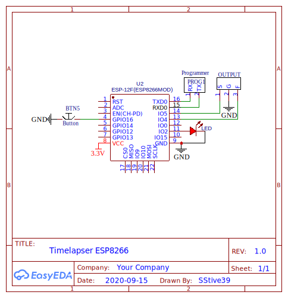
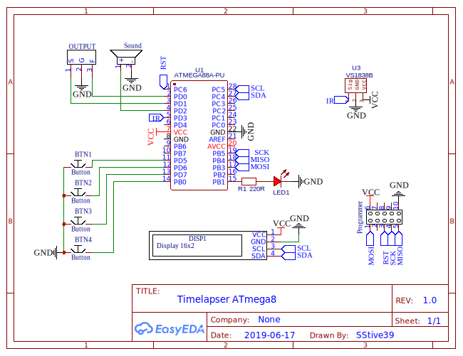

# Timelapser

## Схема

### ESP8266

### ATmega8

## Функции

- BLUB
- Интервальная съемка
- ИК пульт
- Таймер
- Настройка
- Управление с телефона

## UI

- Timelapse
  - Длительность (15с, 30с, 45с, 1мин, 5мин, custom)
  - Интервал (3, 5, 7, 10, 15, 20, custom)
  - FPS (25, 30, 60)
  - Начать

- BLUB
  - Длительность (45с, 1мин, 2мин, 5мин, 10мин, 15мин, 20мин, custom)
  - Начать

- Таймер
  - Длительность (3, 5, 7, 10, 15, 20, custom)
  - Начать

- Настройки
  - Экран
    - Подсветка экрана (Вкл/Выкл)
    - Отключение подсветки (15с, 30с, 45с, 1мин, 5мин, custom)
  - Звук
    - Звук нажатия кнопок (Вкл/Выкл)
    - Звук нажатия кнопок на пльте (Вкл/Выкл)
    - Звук завкршения задачи (Вкл/Выкл)

## Компоненты

- Микроконтроллер (Atmega8)
- Дисплей (LCD1602 I2C)
- Динамик (Зуммер)
- Светодиод
- Резистор
- Кварцевый резонатор
- Кнопки (4 шт)
- Аккумулятор (li-po 500 mah)
- Плата защиты (TP4056)
- Повышающий модуль
- Приемник ИК сигнала (VS1838b)
- Разъем для подключения к фотоаппарату (или выход с переходником)

## Библиотеки

- [LiquidMenu](https://github.com/VaSe7u/LiquidMenu)
- [LiquidCrystal I2C](https://github.com/openenergymonitor/LiquidCrystal_I2C)
- [Arduino Vector](https://github.com/zacsketches/Arduino_Vector)
